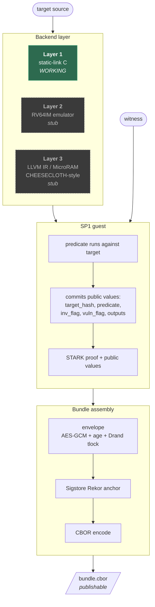

# Orchid Mantis

## A Framework for ZKPoX — Zero-Knowledge Proofs of Exploit

> **Status: experimental (v0.1).** Bundle format, predicate library, and
> verifier semantics are not yet stable. Do not use for real CVE
> disclosure until v1.0 ships. See `docs/SCOPE.md` for the precise
> statement of what current bundles prove.

`zkpox` is a standalone framework for producing and verifying
**zero-knowledge proofs that you possess an exploit for a public
program**, without revealing the exploit.

It ships as two binaries:

| Binary         | What it does                                                              |
|----------------|---------------------------------------------------------------------------|
| `zkpox-prove`  | Convert a target program + an exploit witness into a CBOR disclosure bundle. |
| `zkpox-verify` | Validate a bundle end-to-end: STARK proof, target binding, envelope, anchor. |

The proving backend is the [SP1 zkVM](https://succinct.xyz/). The
disclosure pipeline layers:

1. **AES-256-GCM** under a fresh key `K` over the witness bytes.
2. **age** wrap of `K` to the vendor's public key (vendor-readable now).
3. **Drand tlock** wrap of `K` to a future round (publicly readable after `T`).
4. **Sigstore Rekor** anchor binding the bundle's hash to a time.

So the public proof is verifiable by anyone; the vendor learns the
exploit immediately; the public learns the exploit at `T` (default
90 days, matching Project Zero's CVD norm).

## Quickstart

```sh
# 1. Install the SP1 toolchain (https://docs.succinct.xyz/getting-started/install).
curl -L https://sp1up.succinct.xyz | bash && sp1up

# 2. Build the native binaries.
cargo build --release

# 3. Pre-build a backend for a specific target + predicate.
./target/release/zkpox-prove build-target \
    --target targets/03-libxml2-cve-2017-9047.c \
    --predicate memory-safety::oob-write

# 4. Produce a bundle (witness stays private; bundle is publishable).
./target/release/zkpox-prove prove \
    --target targets/03-libxml2-cve-2017-9047.c \
    --predicate memory-safety::oob-write \
    --witness tests/corpus/03-overflow1-crash.bin \
    --wrap groth16 \
    --output /tmp/bundle.cbor

# 5. Verify it. Strict is the default; every check must complete.
./target/release/zkpox-verify /tmp/bundle.cbor

# Optionally pin the Rekor log's public key to also verify the
# Signed Entry Timestamp (proves the log endorsed the entry):
./target/release/zkpox-verify /tmp/bundle.cbor --rekor-pubkey rekor.pub.pem
```

## What this proves

For each (target program, predicate) pair, a `zkpox-prove` bundle
establishes the statement:

> "Under SP1's STARK verifier, I know an input `w` such that running
> the public target program on `w` causes the public predicate's
> `vuln_flag` to fire without triggering any `inv_flag`. The proof
> commits the hash of the target, the predicate ID and version, and
> the predicate's structured outputs (e.g. byte count and first
> offset of an out-of-bounds write). `w` itself is never disclosed
> by the proof."

What it does **not** prove: control-flow hijack, code execution,
exploit reliability under ASLR/CET/canaries, or anything about the
vulnerability class label — those are operator metadata. See
[`docs/SCOPE.md`](docs/SCOPE.md) for the full statement.

## Architecture



## Documentation

| Document | Purpose |
|---|---|
| [`docs/DESIGN.md`](docs/DESIGN.md) | Architecture + literature anchoring. CHEESECLOTH, Trail of Bits / SIEVE, SoK-on-SNARKs alignment. |
| [`docs/SCOPE.md`](docs/SCOPE.md) | What the proof asserts and what it does not. Read this first. |
| [`docs/PREDICATES.md`](docs/PREDICATES.md) | The predicate library: catalogue, semantics, false-positive / false-negative profile, how to add a new one. |
| [`docs/BUNDLE-FORMAT.md`](docs/BUNDLE-FORMAT.md) | CBOR schema reference. |
| [`docs/THREAT-MODEL.md`](docs/THREAT-MODEL.md) | Who trusts what; failure modes. |
| [`docs/DISCLOSURE-WORKFLOW.md`](docs/DISCLOSURE-WORKFLOW.md) | Using zkpox for real CVD. |
| [`docs/ROADMAP.md`](docs/ROADMAP.md) | Layer 2 / Layer 3 plans; predicate roadmap. |

## Origin

zkpox was extracted from
[gadievron/raptor#470](https://github.com/gadievron/raptor/pull/470)
and rebuilt as a standalone framework. It retains the predicate-library
abstraction and the disclosure-envelope design from that PR, but the
binding hashes are no longer placeholders, the verifier actually
verifies the STARK, the Rekor inclusion proof, and (given the log's
public key) the Rekor Signed Entry Timestamp, and the C-source
target is generic rather than three hardcoded examples.

## Acknowledgements

This work builds directly on:

- **CHEESECLOTH** — Cuéllar, Harris, Parker, Pernsteiner, Tromer,
  USENIX Security 2023 / ACM TOPS 2025. The two-flag (`inv_flag`,
  `vuln_flag`) discipline and the memory-safety predicate catalogue
  come from CHEESECLOTH.
- **Trail of Bits + DARPA SIEVE** — Bain et al.,
  [eprint 2022/1223](https://eprint.iacr.org/2022/1223) and the
  Trail of Bits blog series on ZK proof of exploit.
- **SP1** — Succinct's STARK-based zkVM, audited by Veridise,
  Cantina, Zellic, KALOS.
- **Drand** — distributed randomness beacon used for the time-lock.
- **Sigstore Rekor** — append-only transparency log for the timestamp anchor.
- **age** and **tlock** — public-key and time-lock encryption tools.
- **RAPTOR** — Gadi Evron's agentic security framework, which is
  where this code lived before being extracted.

## License

Licensed under [MIT](LICENSE).
